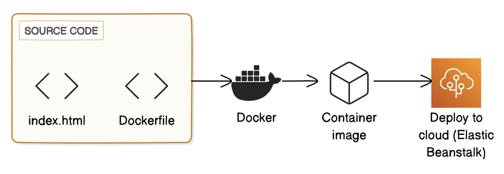

# Containers on AWS Elastic Beanstalk

This project demonstrates how to containerize a web application using **Docker** and deploy it to **AWS Elastic Beanstalk**. The application is a simple Nginx server with a custom HTML page.

## 🔁 Data Flow Diagram

Below is the high-level architecture of this project:



## 🛠️ What I Did

- Learned how **Docker** containers work and created a basic web app using **Nginx**.
- Wrote a `Dockerfile` to build a custom Docker image.
- Ran the image locally using `docker run` and fixed a port conflict.
- Deployed the custom Docker container to **AWS Elastic Beanstalk** using the web interface.

## 🐳 Dockerfile Example

Here is an example of the `Dockerfile` used in this project:

```dockerfile
FROM nginx:latest
COPY index.html /usr/share/nginx/html/
EXPOSE 80
```

### 🔨 Build the Docker Image

Run the following command to build the Docker image:

```bash
docker build -t my-web-app .
```

### 🚀 Run the Docker Container

Use this command to run the container locally:

```bash
docker run -p 80:80 my-web-app
```

## 🌱 Key Learnings

- Containers simplify deployment and ensure consistency.
- Docker Desktop helps debug container issues easily.
- Elastic Beanstalk provides a quick way to host Docker containers without managing infrastructure manually.

## 📎 Documentation

For a detailed walk-through with step-by-step notes, refer to:

[📄 Containers on AWS Elastic Beanstalk.pdf](./Containers%20on%20AWS%20Elastic%20Beanstalk.pdf)
